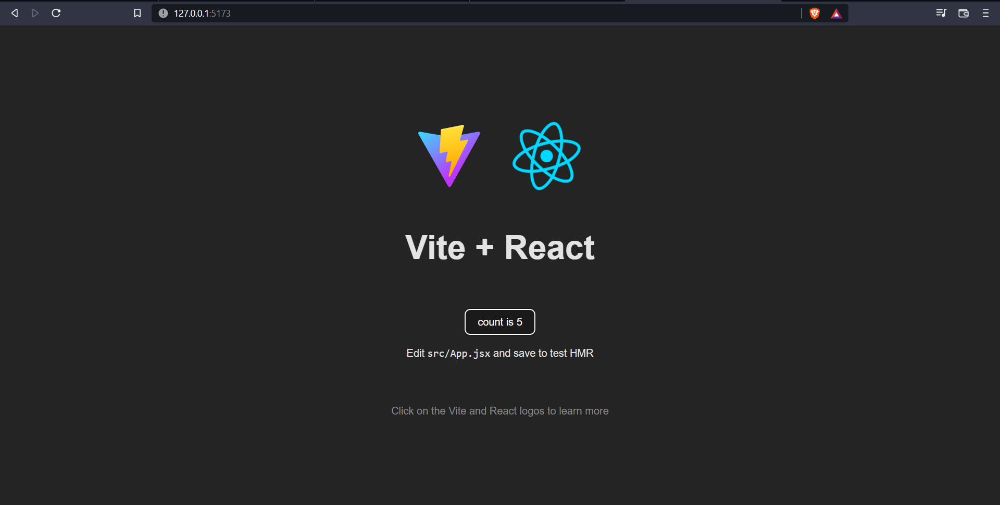

# vite-react-js-template
Vite JS for rapid development of React Apps

## What is Vite ?
- It's a next generation Frontend Tooling, a library of Javascript which helps us to build React, Angular or Vue Apps very much faster than it's own package.
- If we use ```npx create-react-app``` command it would take at least 5 minutes( depend on PC/Laptop resources ) to make a basic boiler template but with ```Vit JS``` it can do the job within seconds.
- While developing the React app ```Hot Reloading``` issue will be solved in Vite JS whenever we change some code in our app.

## Installation 
- Create an React + Vite App
```bash
npm create vite@latest
```
- Go to Project Folder Directory( In this case our Project name is "cd react-vite-startup-template" )
```bash
cd react-vite-startup-template
```
- Install Node & Other Essential Modules
```bash
npm install
```
- Run the App
```bash
npm run dev
```
- Acces the App (Localhost)
```bash
http://127.0.0.1:5173/
```

<p align="center"> Vite + React Demo </p>

## How to Deploy Vite-React App on Netlify ?
- Make a Production Build
```bash
npm run build
```
- To get the Preview Build of App
```bash
npm run preview
```
- Check the Production Build
```bash
 http://127.0.0.1:4173/
 ```
 - Install Netlify in your terminal
 ```bash
 npm i -g netlify-cli
 ```
 - Init the App
 ```bash
 ntl init
 ```
 - Select ```Create & configure a new site```
 - Add a Team & Site(Optional) name...
 ```bash
 Site Created

Admin URL: https://app.netlify.com/sites/super-cool-site-by-bishnudev1
URL:       https://super-cool-site-by-bishnudev1.netlify.app
Site ID:   95315748-07c6-4f67-afbb-3aca601e5a37
 ```
 - After Initially(Insucure) Deployment is done now add your github credintials for accessing Security Key
 - Run Build Comman
 ```bash
 vite build
 ```
 - Add ```dist``` Folder for final Deployment
 ```bash
 netlify deploy --prod
 ```
 - Access it https://super-cool-site-by-bishnudev1.netlify.app
